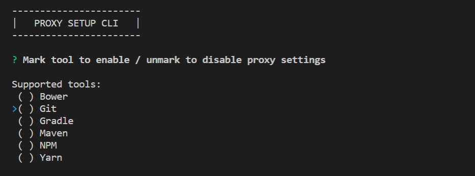

# Proxy Setup CLI

A helpful tool for developers who are working behind a proxy.

## How to use it
The usage of this command line interface is very straightforward:



### Quick reference guide

1. Mark the checkbox of the tool where the proxy settings should be enabled (use `<SPACE>`-key to toggle)
    - If the checkbox of a tool is not marked, the proxy setting will be disabled
2. Press `<ENTER>`-key to confirm the selection
3. If some checkboxes are selected, you will be asked to enter your proxy settings
    - If the proxy does not require username and password, let the username empty (just press the `<ENTER>`-key) 
    - If you have not selected any tool, all proxy settings will be removed and you will not be prompted to insert any proxy settings
4. You will then see a small summary of which proxy settings have been activated or deactivated by the CLI
5. Press any key to exit the CLI

## Supported developer tools
- Bower
- Git
- Gradle
- Maven
- NPM
- Yarn

## Features
- Toggle proxy settings for all tools at once
- Authentication data is only stored in the tool's proxy settings
- Authentication data is completely removed when the proxy is disabled for a tool
- Remembers the last used proxy hosts and ports (press `<TAB>` for autocomplete)

## Download
Navigate to the [releases page](https://github.com/PKief/proxy-setup-cli/releases) of this repository and download the binary of the project.

Binaries are available for
- Windows
- Linux
- MacOS

The binary can be executed directly and does not require any further installation steps.

## Build project
### Requirements
- [Node.js](https://nodejs.org/en/)

### Install dependencies
Install all required dependencies with the following command:

```
npm install
```

### Start the CLI
You can open the CLI in your terminal with this command:

```
npm start
```

### Generate executables
It's also possible to generate an executable file of this CLI. For this purpose Zeit's module [pkg](https://github.com/zeit/pkg) is used to build executable files. Simply run this command to create a binary for each platform:

```
npm run package
```

The binaries can be found in the "package"-directory.

If you want to create a binary for only one platform you have to adjust the `targets` argument in the `package`-script like this:

#### Windows
```json
"package": "pkg --targets=node8-win out/index.js -o ./package/proxy-setup-cli",
```

#### Linux
```json
"package": "pkg --targets=node8-linux out/index.js -o ./package/proxy-setup-cli",
```

#### MacOS
```json
"package": "pkg --targets=node8-macos out/index.js -o ./package/proxy-setup-cli",
```

> Read more about the available [targets](https://github.com/zeit/pkg#targets) of the pkg module.
